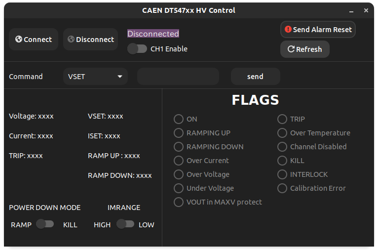

### disclaimer

The project is still under development:
a lot of code need to be properly refactored and almost no
errors are handled up to now.

# A simple controller for CAEN DT547x H.V. Power Supply

This repo contains a simple program, written in c, for the control of the CAEN DT547x Desktop power supply family under GNU/Linux operating systems.

The communication with the module is accomplished via serial over USB using the protocol
described in the instrument's manual provided by the vendor.

## Installation

The only required dependency is gtk 3.0, under ubuntu it should be as simple as:
````bash
sudo apt-get install libgtk-3-dev
````

Then the code can be compiled using the provided CMakeLists:

````bash
mkdir build && cd build
cmake ..
make
````

the GUI can then be launched from the terminal:

````bash
./caenhvctrl
````


## Usage




